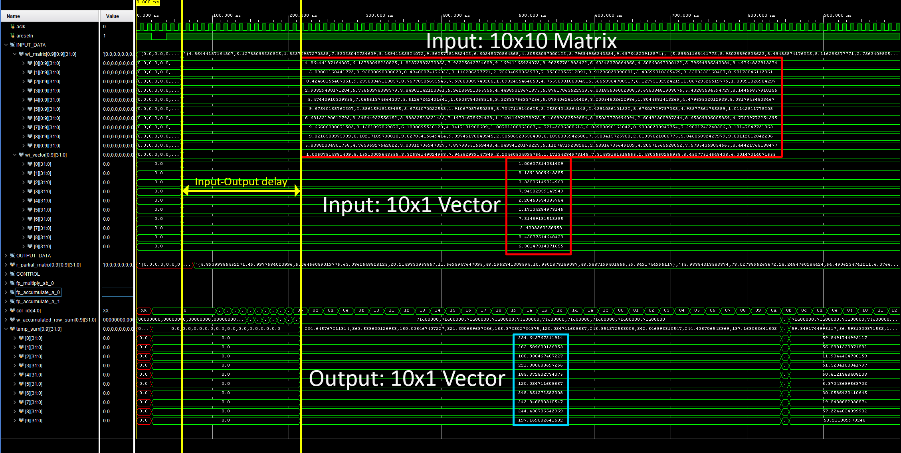

# Floating Point Matrix-Vector Multiplier [IEEE 754 Single Precision Floating Point ]

## Introduction 

This is a floating point matrix-vector multiplier, that operates on a square matrix and a corresponding vector. The module is designed to be highly modular. By changing the parameter specified in the [TensorUnit](./src/TensorUnit.v), this IP can be customized for any square matrix of size NxN and the corresponding vector of Nx1 size. 

## General Architecture

The general architecture of the core multiplier module can be seen in the figure below. 

Inside the core are NxN highly parallelized floating point multiplication modules that calculate the partial matrices in a minimum of 2 clock cycles. The output from this module is a NxN partial matrix. These outputs are then fed into another set of highly parallelized floating point accumulators. These floating point accumulators calculate the output in N clock cycles, where N is the size of the input matrix and vector.

  
# Output Verification

When N is set to 2, the module generates a 2x2 matrix - 2x1 vector multiplier. The input output simulation waveform for N=2 can be seen below. 

  

# Limitation
When set to N = 10, the output is generates but the correctness cannot yet be verified. Take a look at the following waveform for a general sense. 
