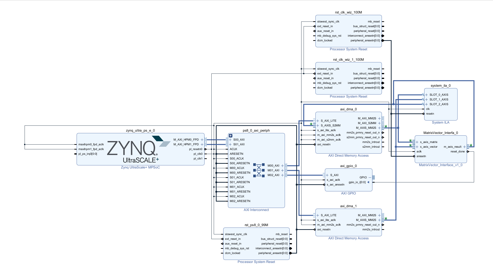

# Floating Point Matrix-Vector Multiplier [IEEE 754 Single Precision]

## Introduction and design architecture

This is a floating point matrix-vector multiplier, that operates on a square matrix and a corresponding vector. The module is designed to be highly modular. By changing the value of parameter **M_SIZE** specified in the [MatrixVector_Interface](./src/MatrixVector_Interface.v), this IP can be customized for any square matrix of size NxN and the corresponding vector of Nx1 size, i.e., N = 2, 3, ..., 10, ... 100 (depending on the requirement and FPGA capacity). 

The [TensorUnit](./src/) is a highly parallel unit that takes in the whole matrix of size $ (M\_SIZE * M\_SIZE) $ and vector of size $ M\_SIZE$ from their respect ports at once and then generates an output vector of size $ M\_SIZE $ in a single port. However, to implement the whole unit at once, we will need a powerful FPGA with many I/Os. However, we need a design that can be implemented in any FPGA with a minimal change.

Therefore, to make this unit modular, the [MatirxVector_Interface](./src/MatrixVector_Interface.v) has been implemented by using the AXI-Stream interface. This unit takes in one 32-bit floating point at a time until all of the N * N 32-bit numbers have been stored internally in the FPGA local memory and once the transmission of the matrix and vector data is done, it passes the data to the TensorUnit and receives the result and then transfers the result back to the processor one floating point number at a time until all of **M_SIZE** vector has been transmitted.

|M_SIZE| Parameter | Value | Description |
|:----:|:---------:|:-----:|:-----------:|
|  10  | Accuracy  | 4 decimal places | The calculations are compared with MATLAB, and have an accuracy up to 4 decimal places | 
|  10  | Latency - MatrixVector_Interface   | 330ns | The calculated latency from starting of the input transmission from Zynq PS to PL to the completion of the result transmission from PL to PS. |
|  10  | Latency - TensorUnit   | 130ns | The calculated latency from starting of the input transmission from MatrixVector_Interface to TensorUnit to the completion of the result transmission from TensorUnit to MatrixVector_Interface. |
|  10  | Throughput - MatrixVector_Interface | 3 Mops  | Based on 100 MHz clock and 330 ns latency |
|  10  | Throughput - TensorUnit | 7.14 Mops | Based on 100 MHz clock and 130 ns latency |

 

## Core Architecture

The general architecture of the core multiplier module can be seen in the figure below. 

Inside the core are NxN highly parallelized floating point multiplication modules that calculate the partial matrices in a minimum of 2 clock cycles. The output from this module is a NxN partial matrix. These outputs are then fed into another set of highly parallelized floating point accumulators. These floating point accumulators calculate the output in N clock cycles, where N is the size of the input matrix and vector.

  
# Output Verification, M_SIZE = 2

When M_SIZE is set to 2, the module generates a 2x2 matrix - 2x1 vector multiplier. The input output simulation waveform for M_SIZE=2 can be seen below. 

Following is the output received from MATLAB

  

# Output Verification, M_SIZE = 3
When M_SIZE is set to 3, the module generates a 3x3 matrix - 3x1 vector multiplier. The output simulation waveform for M_SIZE=3 can be seen below. 

Following is the output received from MATLAB

  

# Output Verification, M_SIZE = 10
When M_SIZE is set to 10, the module generates a 10x10 matrix - 10x1 vector multiplier. The output simulation waveform for N=10 can be seen below. 

Let's see what are where. 

Following is the output received from MATLAB

# Output Verification, N = 10, with MatrixVector_Interface

The following waveform image shows the data transfer with the MatrixVector_Interface. 

 

# FPGA Implementation and the driver

## Block Design
TThe **MatrixVector_Interfa_0** in the following image is the main IP that has been developed. The multiplier IP is connected to the Zynq UltraScale+ Processing System (PS) through the DMA controller using the AXI-Stream Interface.

The FPGA implementation bitstream file corresponding to this design can be found here: [zynq_matrix_hw.bit](./hw/zynq_matrix_hw.bit)

 

## Summary Reports on Timing and Power Analysis. 

Power used by the multiplication IP is shown in the green (PL), which is 0.303 W for **M_SIZE = 10**.

    

    

